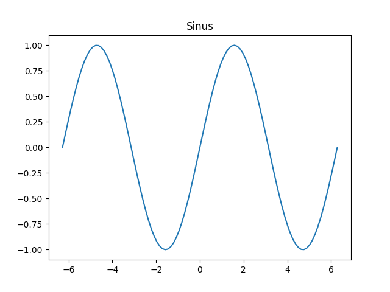

## TP 6 - Représentations graphiques avec Matplotlib

**[Revenir au Sommaire](../README.md)**

Les parties en _italique_ sont des approfondissements qui pourraient être utiles.

- Présentation de Matplotlib
    Matplotlib permet de créer des représentations graphiques de données. Il est possible de créer des graphiques en 2D et 3D, des histogrammes, des courbes, etc.

    Pour importer Matplotlib, il faut utiliser la commande suivante:
    ```python
    import matplotlib.pyplot as plt
    ```

- Création de graphiques simples
    Pour créer un graphique simple, il faut utiliser la fonction `plot` de Matplotlib. Il est possible de personnaliser le graphique en ajoutant des titres, des légendes, des axes, etc.

    ```python
    import matplotlib.pyplot as plt

    x = [1, 2, 3, 4, 5]
    y = [2, 3, 5, 7, 11]

    plt.plot(x, y) # Permet de dessiner la courbe, en reliant les différents points
    plt.title("Graphique simple") # Titre du graphique
    plt.xlabel("Axe des X") # Titre de l'axe des X
    plt.ylabel("Axe des Y") # Titre de l'axe des Y
    plt.show() # Affiche le graphique
    ```

    

    On peut aussi utiliser la fonction `scatter` pour créer un nuage de points.
    ```python
    import matplotlib.pyplot as plt
    abscisses = [1, 2, 3, 4, 5]
    ordonnees = [2, 3, 5, 7, 11]
    plt.scatter(abscisses, ordonnees) # Permet de dessiner un nuage de points
    plt.title("Nuage de points") # Titre du graphique
    plt.show() # Affiche le graphique
    ```

    

- Personnalisation de graphiques

    Il est possible de personnaliser les graphiques en ajoutant des titres, des légendes, des axes, etc. Il est aussi possible de changer la couleur et le style des lignes.

    ```python
    import matplotlib.pyplot as plt

    x = [1, 2, 3, 4, 5]
    y = [2, 3, 5, 7, 11]

    plt.plot(x, y, color='red', linestyle='--', linewidth=2) # Crée une ligne rouge en pointillés de 2 pixels d'épaisseur
    plt.scatter(x, y, color='blue', marker='o', label="Point") # Ajouter des points ronds sur la ligne
    plt.title("Graphique personnalisé") # Titre du graphique
    plt.xlabel("Axe des X") # Titre de l'axe des X
    plt.ylabel("Axe des Y") # Titre de l'axe des Y
    plt.grid() # Affiche une grille
    plt.legend(["Ligne rouge",
                "Points de la ligne"], loc="upper left")
    # Affiche une légende, chaque élément de la liste correspond à un élément du graphique,
    # dans l'ordre du code (plt.plot est en premier dans le code, donc "Ligne rouge" est en premier dans la liste)
    
    plt.show() # Affiche le graphique
    ```

    

    Il est également possible de créer une légende d'une autre façon:
    ```python
    import matplotlib.pyplot as plt
    x = [1, 2, 3, 4, 5]
    y = [2, 3, 5, 7, 11]
    plt.plot(x, y, color='red', linestyle='--', linewidth=2, label="Ligne rouge")
    plt.scatter(x, y, color='blue', marker='o', label="Points de la ligne")
    plt.legend() # On ne met rien dans plt.legend car on a déjà mis les labels dans plt.plot et plt.scatter
    plt.show()
    ```

    

- Générer  des graphiques via des fonctions

    Il faut en premier connaître deux fonctions de `numpy`:
    - `linspace`: permet de créer une matrice de valeurs entre deux bornes, avec un nombre de valeurs donné. Par exemple, `numpy.linspace(0, 10, 5)` crée une matrice de  5 valeurs entre 0 et 10: `[0., 2.5, 5., 7.5, 10.]`
    - `arange`: permet de créer un tableau de valeurs entre deux bornes, avec un pas donné. Par exemple, `numpy.arange(0, 10, 2)` crée un tableau de valeurs entre 0 et 10, avec un pas de 2: `[0, 2, 4, 6, 8]`
    Il faudra choisir entre ces deux fonctions en fonction de ce que l'on veut faire.

    Ces deux fonction génerent une matrice ligne. Il est donc possible d'utliser les fonctions mathématiques de `numpy` sur ces matrices. Par exemple, `numpy.exp` permet de calculer le sinus de chaque valeur de la matrice.
    ```python
    import numpy as np
    x = np.linspace(0, 10, 5) # Crée une matrice de 5 valeurs entre 0 et 10
    y = np.exp(x) # Crée une matrice des valeurs de exp(valeur) pour chaque valeur de la matrice x
    print(y) # Affiche la matrice [1.00000000e+00 1.21824940e+01 1.48413159e+02 1.80804241e+03 2.20264658e+04]
    ```
    
    Exemple en utilisant `linspace` pour la fonction `sinus`:
    ```python
    import matplotlib.pyplot as plt
    import numpy as np
    x = np.linspace(-2 * np.pi, 2 * np.pi, 100) # Crée un tableau de 100 valeurs entre -2pi et 2pi
    y = np.sin(x) # Crée un tableau de 100 valeurs entre -1 et 1
    plt.plot(x, y)
    plt.title("Sinus") # Titre du graphique
    plt.show() # Affiche le graphique
    ```

    

    Exemple en utilisant `arange` pour la fonction `log`:
    ```python
    import matplotlib.pyplot as plt
    import numpy as np
    x = np.arange(0.01, 10, 0.1) # Crée un tableau de valeurs entre 0.01 et 10, avec un pas de 0.1
    y = np.log(x) # Crée un tableau de valeurs entre 0 et 2.3
    plt.plot(x, y)
    plt.title("Logarithme") # Titre du graphique
    plt.show() # Affiche le graphique
    ```

    


- Exemples

    Voir [Révisions sur les fonctions.ipynb](../TPs%20Capytale/Révisions%20sur%20les%20fonctions.ipynb).


Fiche de l'Académie de Versailles (donnée par la prof):
[Fiche PDF](../TP6/tuto_python_matplotlib.pdf)

Lien vers le fichier sur le site de l'Académie de Versailles: [https://phychim.ac-versailles.fr/IMG/pdf/tuto_python_matplotlib.pdf](https://phychim.ac-versailles.fr/IMG/pdf/tuto_python_matplotlib.pdf)


**[← Cours TP 5](../TP5/README.md)**