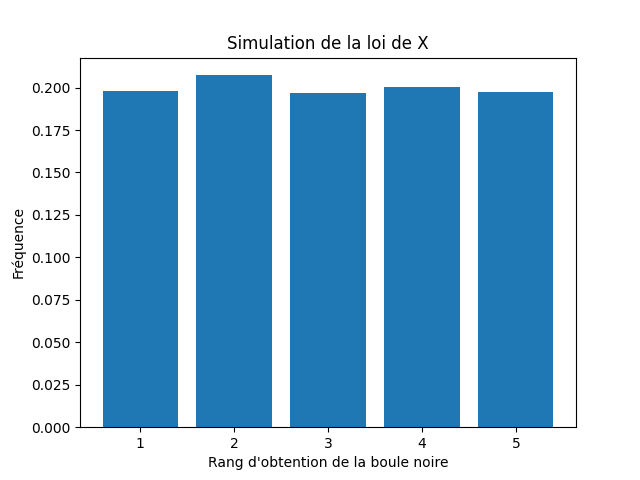

# DS Info – ECG 2 (2024–2025)

**A. BENADDI**  
**Lycée Kléber**

La correction se trouve à la fin du sujet.


---

Pour tout le DS, nous importerons les librairies :

```python
from math import *
import numpy as np
import numpy.random as rd
import matplotlib.pyplot as plt
```

---

## Exercice 1

Pour tout $n \in \mathbb{N}^*$, on pose :

$$
S_n = \sum_{k=1}^{n} \frac{1}{k^2}
\quad \text{et} \quad
S = \sum_{k=1}^{+\infty} \frac{1}{k^2}
$$

tel que l’on a l’encadrement suivant pour tout $n \in \mathbb{N}^*$ :

$$
S_n + \frac{1}{n+1} + \frac{1}{2(n+1)^2}
\;\leq\;
S
\;\leq\;
S_n + \frac{1}{n} + \frac{1}{2(n+1)^2}
$$

### 1)

Compléter la ligne d’instruction en Python qui permet de calculer la somme $S_n$,
pour un entier donné par l’utilisateur :

```python
Sn = sum(.......................)
```

### 2)

Écrire un programme Python qui affiche une valeur approchée de $S$ à $10^{-4}$ près
et le nombre d’itérations nécessaires pour atteindre cette approximation.

---

## Exercice 2

Pour toutes suites numériques  
$u = (u_n)_{n \in \mathbb{N}}$ et  
$v = (v_n)_{n \in \mathbb{N}}$,  
on définit la suite $w$ par :

$$
\forall n \in \mathbb{N}, \quad
w_n = \sum_{k=0}^{n} u_k\, v_{n-k}
$$

On suppose que les suites $u$ et $v$ sont définies par :

$$
\forall n \in \mathbb{N}, \quad
u_n = \ln(n+1)
\quad \text{et} \quad
v_n = \frac{1}{n+1}
$$

Écrire un programme en Python qui demande à l’utilisateur une valeur de l’entier
naturel $n$, qui calcule et affiche les valeurs de :

$$
w_0, w_1, \ldots, w_n
$$

---

## Exercice 3

On s’intéresse dans cet exercice à la série :

$$
\sum_{n \in \mathbb{N}} \frac{(-1)^{n+1}}{n^x},
\quad \text{pour tout } x \in \mathbb{R}.
$$

On admet que pour tout $x \in \mathbb{R}^-$, la série :

$$
\sum_{n \in \mathbb{N}} \frac{(-1)^{n+1}}{n^x}
$$

diverge.

Soit $x \in \mathbb{R}^{+*}$, on note, pour tout $n \in \mathbb{N}^*$ :

$$
u_n = \sum_{k=1}^{n} \frac{(-1)^{k+1}}{k^x}.
$$

On admet aussi que :

- **(a)** Les suites $(u_{2p})_{p \in \mathbb{N}}$ et $(u_{2p+1})_{p \in \mathbb{N}}$  
  sont adjacentes et convergent vers une même limite notée $S(x)$.

- **(b)** $\forall \varepsilon > 0$, il existe $n_0 \in \mathbb{N}^*$ tel que  
  $\forall n \geq n_0$,  
  $|u_n - S(x)| \leq \varepsilon$.

**(c)** La série

$$
\sum_{n \in \mathbb{N}^*} \frac{(-1)^{n+1}}{n^x}
$$

converge et l’on a :

$$
S(x) = \sum_{k=1}^{+\infty} \frac{(-1)^{k+1}}{k^x}.
$$

- **(d)** $\forall p \in \mathbb{N}^*$ :

$$
u_{2p} \leq S(x) \leq u_{2p+1} \leq u_{2p-1}.
$$

- **(e)** $\forall n \in \mathbb{N}^*$ :

$$
|u_n - S(x)| \leq \frac{1}{(n+1)^x}.
$$

En utilisant ce qui précède, écrire une fonction en Python qui,
étant donnés deux réels $x > 0$ et $\varepsilon > 0$,
renvoie une valeur approchée de $S(x)$ à $\varepsilon$ près.


## Exercice 4

L’urne U1 contient $N$ boules :

- $(N - 1)$ boules blanches  
- $1$ boule noire  

On effectue des tirages sans remise dans l’urne U1 jusqu’à l’obtention de la boule noire.
On note $X$ la variable aléatoire qui prend pour valeur le nombre de tirages nécessaires
pour l’obtention de la boule noire.

### 1)

On simule 10000 fois cette expérience aléatoire.  
Recopier et compléter le programme Python suivant pour qu’il affiche un vecteur,
dont les composantes sont les fréquences d’apparition du rang d’obtention de la boule noire :

```python
N = int(input('Donner un entier naturel non nul'))
S = np.zeros(N)

for k in range(10000):
    i = 1
    M = ...  # La variable M désigne le nombre de boules contenues dans l’urne
    while ... :
        i = ...
        M = ...
    S[...] = ...

print(...)
```

### 2)

On exécute le programme complété ci-dessus.
On entre 5 au clavier et on obtient l’histogramme suivant :



Quelle conjecture pouvez-vous émettre sur la loi de la variable aléatoire $X$ ?


# Correction DS


---

## Les modules nécessaires pour le DS

```python
import numpy as np
import matplotlib.pyplot as plt
from math import *
import numpy.random as rd
```

---

## Exercice 1

### Question 1

```python
S_n = np.sum([1/k**2 for k in range(1, n+1)])
```

### Question 2

```python
n = 1
while 1/n - 1/(2*(n+1)**2) > 0.0001:
    n = n + 1

S_n = np.sum([1/k**2 for k in range(1, n+1)])
print("la valeur approchée de S est :", S_n)
```

---

## Exercice 2

```python
n = int(input("n = "))
w = 0
print("w0 =", w)

for k in range(1, n+1):
    w = w + log(k+1)/(n-k+1)
    print("w", k, "=", w)
```

---

## Exercice 3

D’après la question **e)**, il suffit que :

$$
\frac{1}{(n+1)^x} \leq \varepsilon \iff n \geq \frac{1}{\varepsilon^{1/x}} - 1
$$

pour que $u_n$ soit une valeur approchée de $S(x)$ à $\varepsilon$ près,  
ce qui conduit au script suivant :

```python
def evalS(x, eps):
    u = 0
    for k in range(1, floor(1/eps**(1/x))):
        u = u + (-1)**(k+1) / k**x
    return u
```

---

## Exercice 4

Dans ce programme, la variable **M** désigne le nombre de boules contenues
dans l’urne (qui diminue au fil de l’expérience).

Donc, à chaque tirage, la probabilité de tirer la boule noire est :

$$
\frac{1}{M}.
$$


```python
N = int(input("Donner un entier naturel non nul"))
S = np.zeros(N)

for k in range(10000):
    i = 1
    M = N
    while rd.random() > 1/M:
        i = i + 1
        M = M - 1
    S[i-1] = S[i-1] + 1 # Le prof a mis S[i]=S[i]+1 mais ca ne marche
                        # pas car la liste commence avec l'indice 0
                        # alors que notre i commence à 1.

print(S/10000)
```

On sait tout d’abord que :

$$
X(\Omega) = \{1, 2, 3, 4, 5\}.
$$

D’après l’histogramme donné, il semble que la variable aléatoire $X$ suive
une **loi uniforme** sur :

$$
\{1, \ldots, 5\}.
$$
